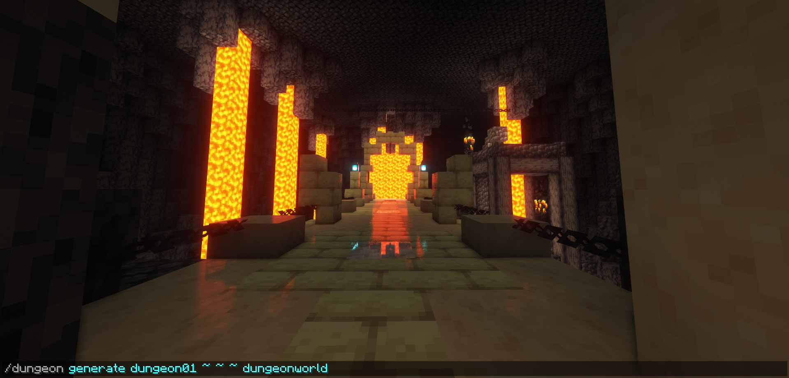
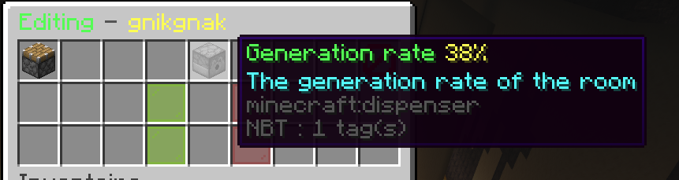
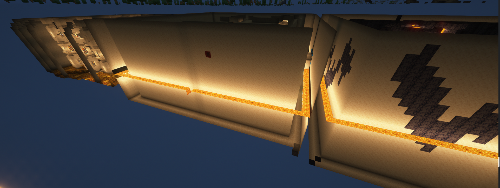

  

  # 🏰 ProceduralDungeon (Latest Version Fork)
  
  **A powerful procedural dungeon generator for your Minecraft server.**

  Original Logo Made By <a href="https://github.com/Zarinoow">Zarinoow</a>
    

  > ⚠️ **NOTICE:** This repository is a **FORK** of the original <a href="https://github.com/Zarinoow/ProceduralDungeon">ProceduralDungeon</a>. It has been specifically updated, optimized, and maintained to ensure full compatibility with the **latest versions** of Minecraft. 

---

## 📖 About ProceduralDungeon

**ProceduralDungeon** allows you to generate dungeons procedurally on your server. Depending on the parameters entered and your pre-saved rooms, the plugin intelligently generates an expansive set of randomized, interconnected rooms.

  

---

## ✨ Features

*   ♾️ **Unlimited Rooms:** Register and save as many unique rooms as you need.
*   📐 **Massive Scaling:** Can generate one room up to **sixty-four** times (maximum theoretical value).
*   ⚙️ **Custom Generation Rates:** Generation probabilities are fully configurable per room.
*   ♻️ **Smart Reuse:** Choose whether the plugin is allowed to reuse specific rooms during generation.
*   🖥️ **Flexible Generation:** Trigger generation as a player or directly from the console.
*   👥 **Team Configuration:** Configure the dungeon or specific rooms collaboratively as a team.
*   ⚡ **Dynamic GUI:** No server reload needed for GUI updates!

  

---

## 🛠️ Commands & Permissions

### Legend
*   `{}` : Required arguments
*   `()` : Optional arguments
*   `x`, `y`, `z` : Coordinates where the dungeon should spawn (Use `~` for your current position).

| Permission Node | Command | Description |
| :--- | :--- | :--- |
| `proceduraldungeon.dungeon` | `/dungeon` (or `help`) | Base command to access plugin features. |
| `proceduraldungeon.admin.reload` | `/dungeon reload` | Reloads the configuration and dungeons. |
| `proceduraldungeon.admin.create` | `/dungeon create {folder}` | Create or import an existing dungeon from a folder. |
| `proceduraldungeon.admin.remove` | `/dungeon remove {dungeon}` | Removes the dungeon from the config (keeps files). |
| `proceduraldungeon.admin.delete` | `/dungeon delete {dungeon}` | **Permanently** deletes a dungeon, including all files. |
| `proceduraldungeon.admin.addroom` | `/dungeon addroom {dungeon} (name)` | Creates a room (Use `/dungeon setexit` first). |
| `proceduraldungeon.admin.generate` | `/dungeon generate {dungeon} {x} {y} {z} (world)` | Generates the dungeon at specified coordinates. |
| `proceduraldungeon.admin.edit` | `/dungeon edit {dungeon} (roomNumber)` | Open the GUI to configure dungeon/room properties. |
| `proceduraldungeon.admin.edit.deleteroom` | *GUI Interaction* | Allows you to remove a room via the edit GUI. |
| `proceduraldungeon.admin.list` | `/dungeon list` | View a list of all imported or importable dungeons. |

  

---

## 🚀 Installation Guide

1.  **Server Version:** Ensure you are running the latest version of Minecraft on your server.
2.  **Download:** Download the latest release of this plugin fork and place it in your `/plugins` folder.
3.  **Dependencies:** Install the required dependencies listed below.
4.  **Restart:** Restart your server. *(⚠️ **DO NOT** use `/reload` or plugman load!)*
5.  **Enjoy:** Start creating your procedural dungeons!

---

## 📦 Dependencies

### Required

| Plugin | Description | Download |
| :--- | :--- | :--- |
| [WorldEdit](https://enginehub.org/worldedit) | Used for room selection, saving, and pasting schematics during dungeon generation. | [CurseForge](https://dev.bukkit.org/projects/worldedit/files) |
| [FastAsyncWorldEdit (FAWE)](https://github.com/IntellectualSites/FastAsyncWorldEdit) | Alternative to WorldEdit with better performance. Install **one** of the two. | [CI Build](https://ci.athion.net/job/FastAsyncWorldEdit/) |

### Optional

| Plugin | Description | Download |
| :--- | :--- | :--- |
| [PacketEvents](https://github.com/retrooper/packetevents) | Packet manipulation library. Reserved for future feature expansions. | [SpigotMC](https://www.spigotmc.org/resources/packetevents-api.80279/) |
| [Vault](https://github.com/MilkBowl/Vault) | Economy/permissions hook. Reserved for future integration (e.g. dungeon entry cost). | [SpigotMC](https://www.spigotmc.org/resources/vault.34315/) |
---

## 🤝 Support & Community

*   **Discord Support:** Join the community and get help here: [Discord Invite](https://discord.gg/jbg6x8Buum)
*   **Servers using ProceduralDungeon:** *Be the first! Let us know in Discord to get featured here.*

---

## ⚖️ Terms of Use

*   **Respect the Work:** This plugin is public and free to use. Please be respectful of the time and effort put into it.
*   **No Stealing:** The code is open for educational purposes. It is **under no circumstances tolerated to copy or steal this code** without prior consent.
*   **No Unauthorized Modifications:** It is strictly forbidden to modify and redistribute the source code without prior agreement.
*   **No Warranty:** I have no obligation to maintain this project forever; it is free and done in my spare time. Thank you for understanding.

**Have fun using it!**